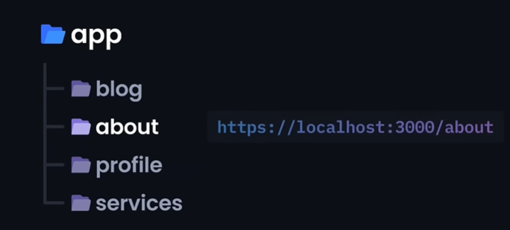

# NextJs: AI prompt sharing web application

## What does NextJs have that React doesn't?

NextJs simplifies and optimizes the web-application due to its primary features such as:

- Rendering:

  - The primary difference between React and NextJs in terms of rendering is that React renders user-interface on the client side while NextJs does it on the server-side.
  - NextJs also offers rendering options on either client or server side according to our needs.

- SEO:

  - The performance of SEO is minimized while it is rendered on the client-side; this issue is resolved by NextJs as it sends pre-rendered code directly to the client.

- Routing:

  - NextJs uses file-based routing system, where the directory handles the routing.
    
  - No external packages is needed as we do in React.

- API Routes:

  - Serverless APIs: NextJs allows building and deploying of APIs without worrying about its infrastructure and traffic.

- Automatic Code Splitting:
  - Breaks large bundles of JavaScript code into smaller and manageable chunks that can be loaded when needed. This reduces load time and increases the user experience. This is done automatically in NextJs.
  - In react this is done manually using the `lazy` and `Suspense` function.

NextJs is built upon ReactJs, in which the development process is done more efficiently by automating several functions such as routing, code splitting, SEO, automatic rendering.

## What does NextJs have that React doesn't?

Create project using npx: `npx create-next-app@latest ./`
