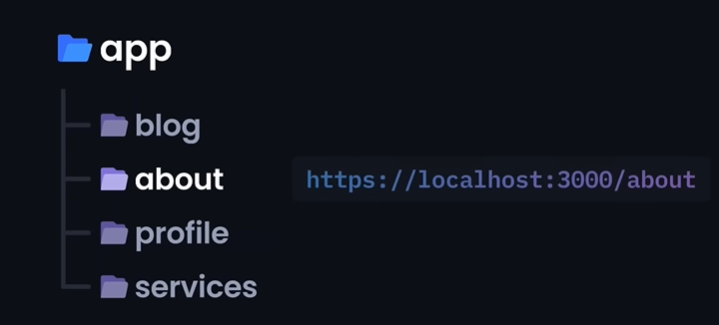
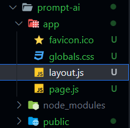
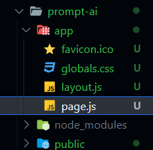
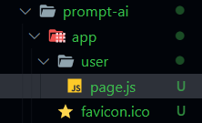
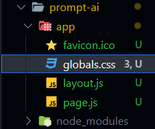
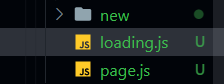
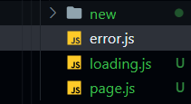
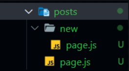
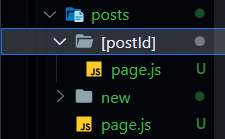
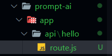

# NextJs 13: AI prompt sharing web application

## What does NextJs 13 have that React doesn't?

NextJs simplifies and optimizes the web-application due to its primary features such as:

- Rendering:

  - The primary difference between React and NextJs in terms of rendering is that React renders user-interface on the client side while NextJs does it on the server-side.
  - NextJs also offers rendering options on either client or server side according to our needs.

- SEO:

  - The performance of SEO is minimized while it is rendered on the client-side; this issue is resolved by NextJs as it sends pre-rendered code directly to the client.

- Routing:

  - NextJs uses file-based routing system, where the directory handles the routing.
    
  - No external packages is needed as we do in React.

- API Routes:

  - Serverless APIs: NextJs allows building and deploying of APIs without worrying about its infrastructure and traffic.

- Automatic Code Splitting:
  - Breaks large bundles of JavaScript code into smaller and manageable chunks that can be loaded when needed. This reduces load time and increases the user experience. This is done automatically in NextJs.
  - In react this is done manually using the `lazy` and `Suspense` function.

NextJs is built upon ReactJs, in which the development process is done more efficiently by automating several functions such as routing, code splitting, SEO, automatic rendering.

## Project:

Create project using npx: `npx create-next-app@latest ./`

### File Characteristics:

1. layout.js



The `layout.js` file serves as a template file where the code reflects on every route page. Allows customization to the application. | [ref](https://nextjs.org/docs/app/api-reference/file-conventions/layout)

2. page.js



The `page.js` file is the homepage in NextJs pack containing the boilerplate code. The page is mandatorily rendered in server-side, but to render it via the client side, `use client` must be used on the top of the code.

The `use client` is utilized when React's client-side or other client management functions. | [ref](https://nextjs.org/docs/getting-started/react-essentials)



The `page.js` is located in the app > user directory which reflects as the localhost:3000 page.

3. globals.css



Every routes inherit the styling from the `globals.css` file.

4. loading.js



The `loading.js` file can display a loading skeleton of the UI while loading or just a loading UI. This is a big advantage for error handling.

5. error.js



The `error.js` manages error handling and this is a client-side rendering function.

### Nested Routing:

Nested routing in React:

```
<Route path='posts' element={<Posts />}>
  <Route path='new' element={<NewPost />} /> {/*A nested route!*/}
  <Route path=':postId' element={<Post />} /> {/*A nested route!*/}
</Route>
```

Nested routing in NextJs:

Just nesting folders within another folder can enable routing.



posts → /posts <br/>
posts > new → /posts/new

### Dynamic routing:

Dynamic pages allows our website to generate URLs on the go.

```
<Route path=':postId' element={<Post />} /> {/*A nested dynamic route!*/}
```



By wrapping a folder in square brackets `[]`, the pages with the folder are dynamically routed.

### Data Fetching

1. Server Side Rendering (SSR)

- This allows dynamic server rendered data where the data is fetched fresh on each request. Each request triggers a new rendering cycle in SSR ensuring that the data is up-to-date.

2. Static Site Generation (SSG)

- In default NestJs uses SSG, it automatically fetches and caches it. This is essential for pages that are not changed frequently (eg: blog posts, documentation or marketing pages).

3. Incremental Static Generation (ISG)

- With this we can choose the data to be statically fetched at build time where a `revalidation time` is defined. This specifies a certain time frame where the data

### API Endpoint:

A backend routing page must be named as `route.js` within the routing folder. But this isn't a good method, hence it is best to separate a folder for backend endpoints and keep the API endpoint page in it.



## Resources:

- [Next.js 13 Full Course 2023 by JavaScript Mastery](https://youtu.be/wm5gMKuwSYk)
- [NextJs Documentation](https://nextjs.org/docs)
- [NPM vs. NPX](https://www.freecodecamp.org/news/npm-vs-npx-whats-the-difference/)
